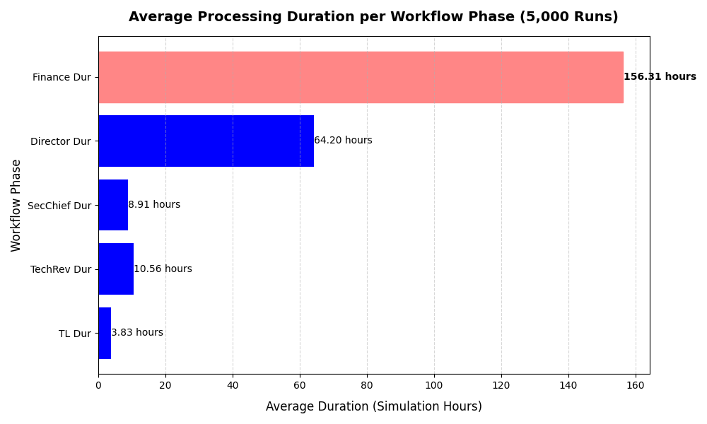

### ⚙️Proposal Pipeline Simulation using Discrete-Event Simulation (DES)
###### *A Discrete-Event Simulation of project proposal pipeline in an organization.*

---
### ⚠️Problem Statement

A Project Proposal is a process or documentation that necessitates approval and validation from multiple concerned individuals. Each individual looks into the project to assess its viability, constraints, and required resources. Organizations are used to creating these, and they undergo bureaucratic processes until their project is approved.

This project aims to simulate the project proposal pipeline of one organization `to develop a robust simulation model` and `identify potential bottlenecks` in the process.

---
### 🖥️Tech Stack
#### **SimPy**
A Python package used to programmatically create DES models.

#### **Joblib**
A Python library used for parallel computing. This library was used to execute thousands of simulation runs simultaneously.

#### **Pandas**
Used to parse the simulation data into a DataFrame for further data analysis.

#### **Matplotlib**
A visualization tool used to organize the simulation data into a graph.

---
### 🔍Findings
The results of the simulation show that the 5-step processs of project proposals in the organization takes longest at the last step: The **Budget Acquisition phase**, with an average of 156.31 simulation hours.

This result is consistent with its real-world counterpart. The organization makes a big consideration to the processing duration of their budget requests. This phase is an essential part of their planning because they want to ensure that their resources can be procured as soon as possible. However, all other phases precedes this. Therefore, it is important that all preceding phases go as smoothly as possible.

---
###### &copy; All Rights Reserved | Jasper Gomez